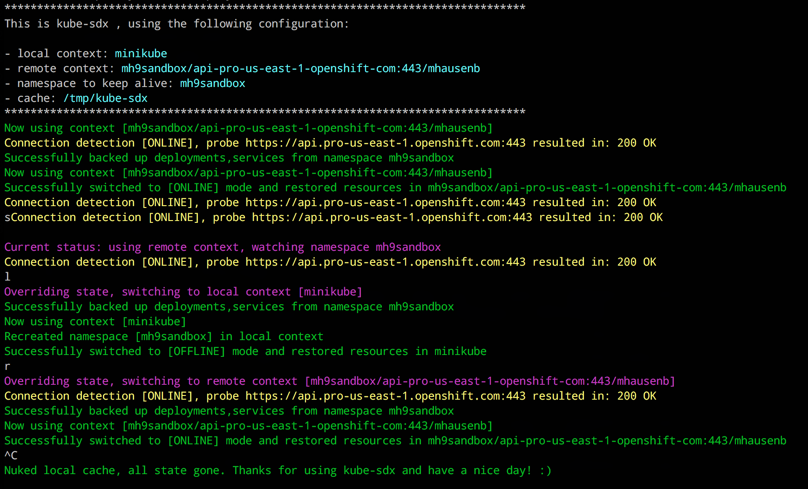

# Walkthrough

Let's do a hands-on walkthrough with `kube-sdx` now.

First, we have a look at the available command line parameters: 

```bash
$ kube-sdx -h
Usage of kube-sdx:
  -local string
     the local context you want me to use (default "minikube")
  -namespace string
     the namespace you want me to keep alive (default "default")
  -policy string
     defines initial context to use and the kind of resources to capture, there (default "local:deployments,services")
  -remote string
     the remote context you want me to use
  -verbose
     if set to true, I'll show you all the nitty gritty details
```

Now let's launch it with some sensible values set:

```bash
$ kube-sdx \
  --namespace=mh9sandbox \
  --remote=mh9sandbox/api-pro-us-east-1-openshift-com:443/mhausenb
  --policy="remote:deployments,services"
********************************************************************************
This is kube-sdx 0.2, using the following configuration:

- local context: minikube
- remote context: mh9sandbox/api-pro-us-east-1-openshift-com:443/mhausenb
- namespace to keep alive: mh9sandbox
- cache: /tmp/kube-sdx
********************************************************************************
Now using context [mh9sandbox/api-pro-us-east-1-openshift-com:443/mhausenb]
Connection detection [ONLINE], probe https://api.pro-us-east-1.openshift.com:443 resulted in: 200 OK
Successfully backed up deployments,services from namespace mh9sandbox
Now using context [mh9sandbox/api-pro-us-east-1-openshift-com:443/mhausenb]
Successfully switched to [ONLINE] mode and restored resources in mh9sandbox/api-pro-us-east-1-openshift-com:443/mhausenb
Connection detection [ONLINE], probe https://api.pro-us-east-1.openshift.com:443 resulted in: 200 OK
s
Connection detection [ONLINE], probe https://api.pro-us-east-1.openshift.com:443 resulted in: 200 OK
Current status: using remote context, watching namespace mh9sandbox
Connection detection [ONLINE], probe https://api.pro-us-east-1.openshift.com:443 resulted in: 200 OK
l
Overriding state, switching to local context [minikube]
Successfully backed up deployments,services from namespace mh9sandbox
Now using context [minikube]
Recreated namespace [mh9sandbox] in local context
Successfully switched to [OFFLINE] mode and restored resources in minikube
r
Overriding state, switching to remote context [mh9sandbox/api-pro-us-east-1-openshift-com:443/mhausenb]
Connection detection [ONLINE], probe https://api.pro-us-east-1.openshift.com:443 resulted in: 200 OK
Successfully backed up deployments,services from namespace mh9sandbox
Now using context [mh9sandbox/api-pro-us-east-1-openshift-com:443/mhausenb]
Successfully switched to [ONLINE] mode and restored resources in mh9sandbox/api-pro-us-east-1-openshift-com:443/mhausenb
^C
Nuked local cache, all state gone. Thanks for using kube-sdx and have a nice day! :)

$
```

And here in color:



Note that following:

- Messages in yellow are from the connection detection module
- Messages in green are from the backup and restore module
- Messages in cyan are from feedback to interactive input (`s`, `r`, `l`)

All modules are running concurrently, so outputs may appear in unpredictable order.

When you use the `--verbose` flag, you'll in addition see messages in blue, coming from the low-level shelling out, effectively showing which `kubectl` commands have been issued.